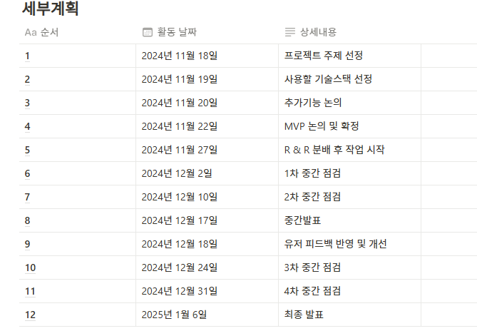

# 모읽지(Moilji)_BACKEND

코드잇 스프린트 5기 협업 프로젝트를 통해 진행한 독서 커뮤니케이션 웹 서비스 서버 코드 입니다.

# 프로젝트 소개
모읽지(Moilji) 는 독서 모임과 커뮤니티 기능을 제공하는 플랫폼으로, 사용자들이 함께 책을 읽고 토론하며 성장할 수 있는 환경을 제공합니다.

# 개발 기간
--- 
+ 2024.11.18 ~ 2025.01.06

# BACKEND_개발자

+ 한재민: 모임, CI/CD
+ 정한별: 사용자/인증, 독서/모임 리뷰

# 개발 환경
+ Java 17
+ Framework: Springboot 3.3.5
+ Database: MySql(AWS RDS)
+ ORM: JPA
+ NoSql: Redis
+ CI/CD: GitHub Actions
+ AWS S3

# ERD

# 서버구성도
